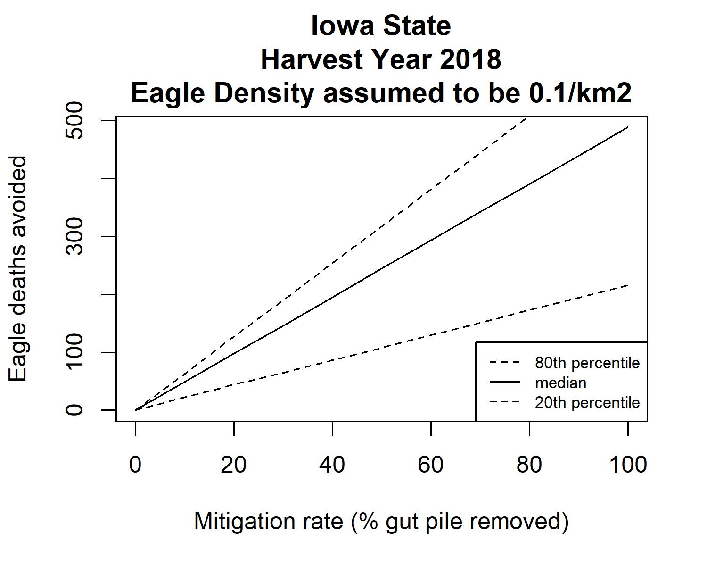

# Eagle_Lead_Abatement_Model
Determines mitigation effort needed for reducing eagle mortality from lead poisoning based on Cochrane et al. (2015).

## Calculation
Expected mortality is influenced by availability of gut piles per eagle and amount of blood lead concentration 
increase per gut pile ingested. Mortality is obtained with the joint probability - quantity of gut piles scavenged and blood 
lead concentration per gut pile consumed.

	<b> Expected Eagle Mortality = Population size x Mortality Rate </b>

The model incorporates two mitigation scenarios at several levels and uses proportional decreases in mitigation at levels 10% thru 100% at 10% increments.

Mitigation Scenarios:
1)	Reduce the number of gut piles containing lead
2)	Reduce lead in the gut piles (ie. convert hunters to non-lead shot)

## Model Input
A .csv file containing 
- hunt unit name
- hunt unit area
- total deer harvest for each respective hunt unit
- eagle density for each hunt unit
Deer harvest reports by county/hunt unit can be found on the Department of Natural Resources (DNR) website for each specific state.
For example, Iowa DNR Deer & Turkey Harvest Report can be found [here](https://gooutdoorsiowa.com/RealTimeHarvestReport.aspx).
Eagle density is not as easily available...

## Reference
Cochrane J.F., E. Lonsdorf, T. D. Allison and C.A. Sanders-Reed. 2015. Modeling with 
uncertain science: estimation mitigation credits from abating lead poisoning in Golden 
Eagles. Ecological Applications, 25(6): p 1518 – 1533.

Link to the publication online [here](https://pdfs.semanticscholar.org/48c6/c65f89f6d2e0cba61f17b0fa658ab0b5f7ac.pdf)

